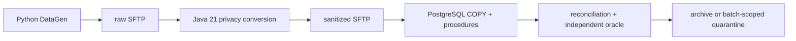

# NorthWind Pay legacy EDP

This repository reconstructs a contract-controlled payment-file process as a
local legacy baseline:



Handlers for Types `01`–`05`, the generic synchronous runner, and the automatic
manifest-ready worker are implemented in the current checkout. Their pure,
component, Java, and worker security tests are part of the standard source
gates. On 2026-07-24, separate clean-runtime synchronous and automatic-worker
portfolios passed. A subsequent Type `01` parity pass re-ran the current source
gates, PostgreSQL regressions, and an isolated five-scenario Type `01`
acceptance. That evidence completes the legacy stopping boundary; Dark Factory
implementation is the next phase and has not started in this repository.

## Delivery status

| Scope | Current evidence boundary |
|---|---|
| Contracts and DataGen, Types `01`–`05` | Implemented with canonical five-outcome fixtures and executable contract tests |
| Java conversion, Types `01`–`05` | Implemented; exact parser, privacy, rejection, and CSV regressions run in the pinned Java 21 image |
| PostgreSQL, Types `01`–`05` | Migrations `001`–`010`, typed loaders, secured procedures, and rollback/reconciliation tests implemented |
| Generic synchronous workflow | Implemented for scenario and explicit-file execution across Types `01`–`05` |
| Continuous worker | Implemented with bounded `processing → cache → incoming` discovery, one-host lock, exact-three private cache, separate terminal-recovery journal, heartbeat, per-batch isolation, and clean signal handling |
| Fresh live five-type acceptance | Verified 2026-07-24: 15 successes, 10 expected quarantines, three `MATCHED` reconciliations per type, and 25 evidence packets |
| Live worker acceptance | Verified 2026-07-24 through `make test`: 25 canonical cases (`15` success, `10` quarantine), four exact-batch restart probes, one integrity quarantine, and one oracle mismatch |
| Dark Factory | Next phase; not implemented |

## Four truth roles

The project deliberately keeps four roles separate:

| Role | Meaning here |
|---|---|
| System of record | The simulated source owns its raw file and declared source controls; committed PostgreSQL tables own applied legacy state |
| Source of observation | Immutable SFTP bytes, hashes, manifests, database observations, and per-run evidence show what actually happened |
| Source of correctness | Independently reviewed expected CSV, reconciliation, and governed business rules define what should happen |
| Executable Git contract | Versioned YAML, schemas, canonical fixtures, and tests encode the currently approved expectation |

A source system can be the system of record and still emit a defective batch.
The oracle may identify that mismatch, but no implementation is allowed to
silently redefine its own expected answer.

## Quick start

Requirements are Docker with Compose, GNU Make, and Python 3.12 or newer.

```bash
make init
make deploy
make status
make run TYPE=01 SCENARIO=valid-minimal
```

All five types use the same public runner:

```bash
make run TYPE=05 SCENARIO=rounding-half-up
make run TYPE=all SCENARIO=valid-minimal
make run-file TYPE=03 FILE=/absolute/path/to/source.rem
```

`TYPE=all` is supported where one operation can be applied safely to each
registered type: `gen`, `run`, and `test-e2e`. An explicit file always requires
one exact type.

## Automatic intake

Deployment starts SFTP and PostgreSQL, applies migrations, and checks
connections. It does not background a worker. Start one in the foreground:

```bash
make worker
```

For a bounded operational or integration check:

```bash
make worker-once MAX_BATCHES=10 POLL_INTERVAL=1
```

The worker reads only final readiness manifests and orders candidates as
`raw/processing → retained private cache → raw/incoming`. The cache contains
exactly the manifest, raw file, and checksum; terminal recovery metadata never
weakens that transport boundary. Before a rejection or oracle-mismatch raw
move, the workflow atomically writes a separate private, source-identity-bound
journal. A retained-cache retry validates that journal and finishes database
control plus immutable evidence without rerunning Java.

The worker dispatches from manifest identity, continues after batch-scoped
failures, holds a non-blocking host lock, and atomically writes a private
heartbeat to `.runtime/worker-status.json`. SIGINT and SIGTERM stop it after
the active bounded cycle.

## Make facade

Run `make help` for the authoritative target and variable list. Common targets:

```bash
make gen TYPE=all SCENARIO=valid-minimal
make publish BATCH=B202607230000001
make migrate
make check
make test-type01
make test-postgres
make test-e2e TYPE=05
make test-e2e TYPE=all
make down
```

`make check` is source/pure plus build: contracts, DataGen and strict typing,
Python unit/oracle/worker-security tests, strict worker-boundary typing,
Compose/schema checks, and the Java image build. `make test-type01` visibly
walks Type `01` through its named contract, generator, loader, workflow,
oracle, shared security/infra, Java, PostgreSQL, and live acceptance layers.
`make test-type01`, `make test-postgres`, `make test-e2e`, and
`make test-worker-e2e` require a deployed disposable runtime. `make test` adds
rollback-only PostgreSQL tests and the
automatic-worker E2E suite, whose fresh-runtime catalog covers all 25 canonical
outcomes across Types `01`–`05`. The synchronous typed suites remain
independently callable with `make test-e2e`; combining both live portfolios on
one runtime would reuse immutable batch IDs. No test target cleans state on the
user's behalf.

`publish-raw`, `run-type`, and `clean-runtime` remain compatibility aliases.
Publication requires exactly one of `BATCH` or `BUNDLE`.

## Database evolution

`make deploy` invokes the immutable migration runner before its final health
check. Versions `001`–`010` establish the shared schemas, Type `01` procedures,
the five-type control plane, Types `02`–`05`, Type `05` control and `HALF_UP`
constraints, and legal multi-row aggregate widths. Repeating `make migrate`
against unchanged files is idempotent; applied filename or checksum drift is
refused.

## Safety and lifecycle

Raw synthetic files contain deliberately restricted identifiers. Java is the
mandatory privacy boundary: raw values may not enter sanitized CSV, logs,
evidence, staging, operational tables, or reconciliation unless their contract
explicitly permits a validated transformation or evidence reference. Evidence
is adapter-allowlisted: Type `01` may retain its approved safe transaction
reference and derived amounts, while PAN, CPF, and unapproved source fields
remain forbidden.

Services bind to `127.0.0.1`. SFTP roles are separated, PostgreSQL application
access is non-superuser, publication is manifest-last, and terminal failures
are batch-scoped.

Cleanup is destructive and never implicit:

```bash
make clean CONFIRM=clean-runtime
```

It removes Compose volumes plus the repository's disposable `.runtime/` and
`evidence/` trees. Preserve anything needed before running it.

## Legacy stopping boundary — verified 2026-07-24

The legacy round is complete. In the clean synchronous portfolio, every type
produced three committed successes and two expected quarantines. The accepted
paths reported `MATCHED` three times per type; business-row counts were
`4/4/5/8/5` for Types `01`–`05`. Transport ended with 15 raw archives, 10 raw
quarantines, 15 CSV archives, and 25 evidence packets.

The separate clean `make test` portfolio passed 40 contract, 65 DataGen, 134
Python unit, 15 security, 31 oracle, 78 Java, and 12 PostgreSQL tests before
the automatic worker completed 25 canonical outcomes (`15` success and `10`
quarantine), one integrity quarantine, and one deliberately forced
`oracle_mismatch`. Exact-batch restart probes covered `database_commit`,
`raw_archive`, rejection `raw_quarantine`, and oracle-mismatch quarantine.

The preserved terminal topology contained 15 raw archives, 12 raw
quarantines, one deliberately incomplete raw incoming upload, 15 CSV archives,
one CSV quarantine, 26 database control batches, 11 rejects, and 26 evidence
packets. Both the exact-three intake cache and the terminal-recovery journal
were empty.

After Type `01` was normalized from its first-mover prototype names, the
current source/build gates passed with 47 contract, 68 DataGen, 144 Python
unit, 15 security, 31 oracle, and 78 Java tests. PostgreSQL passed 13
rollback-only regressions. A separate fresh `make test-type01` run then
verified all five Type `01` scenarios end to end: three succeeded with
`MATCHED` reconciliation and two were quarantined with
`INVALID_OVERPUNCH` and `SOURCE_CONTROL_TOTAL_MISMATCH`. The earlier full
worker portfolio was not rerun as part of this deliberately Type `01`-only
pass. The Type `01` Java class was also forced past Docker's build cache:
13 tests executed with zero failures or skips.

Worker entrypoints intentionally use `scenario=None`: each packet is internally
reconciled but unscored against a named fixture. The acceptance harness
independently maps canonical identities to expected outcomes and verifies
terminal codes, controls, reporting, transport, and privacy.

This is the stopping point that permits Dark Factory work to begin next. It is
not evidence that the Dark Factory itself has been implemented.

## Documentation

- [Documentation index](docs/README.md)
- [Completed legacy baseline, architecture, operations, and proof ledger](plans/legacy.md)
- [Dark Factory starting brief](plans/dark-factory.md)
- [Modern target plan](plans/modern.md)
- [Processor boundary (Java)](legacy/processor/README.md)
- [Legacy PostgreSQL boundary](legacy/postgres/README.md)
- [Type 01 verification map](tests/README.md)
