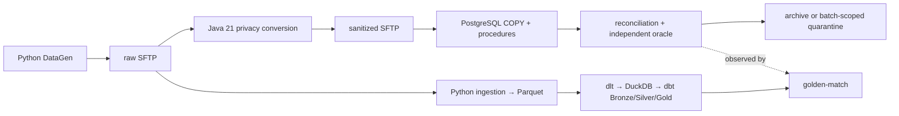

# NorthWind Pay EDP

A contract-controlled payment-file estate, built twice on purpose: a **working
legacy system**, an **independent modern replacement**, and a **factory** that
adjudicates between them with evidence.



Both stacks read the same contracts and the same bytes. Neither reads the
other's code. When they disagree, `contracts/` decides which one is wrong.

## The repository

| Folder | Lines | What it is |
|---|---:|---|
| [`legacy/`](legacy/README.md) | 29,732 | The system that works. **A frozen oracle** — never modified to make a gate pass |
| [`tests/`](tests/README.md) | 22,343 | Live acceptance, contract oracles, unit, PostgreSQL, security |
| [`gen/`](gen/README.md) | 9,336 | DataGen: the simulated source system |
| [`modern/`](modern/README.md) | 6,888 | The independent second implementation |
| [`factory/`](factory/README.md) | 5,996 | The source-defect detector |
| [`contracts/`](contracts/README.md) | 5,748 | **The source of correctness.** Five file types, their fixtures, their oracles |
| [`validation/`](validation/README.md) | 3,768 | The two referees: legacy oracles and golden-match |
| [`plans/`](docs/README.md) | 2,233 | What is being built and why |
| [`infra/`](infra/README.md) | 107 | The SFTP image and the role/zone matrix |

Every folder documents itself. Start at the [documentation
index](docs/README.md).

## Four truth roles

The project deliberately keeps four roles separate:

| Role | Meaning here |
|---|---|
| System of record | The simulated source owns its raw file and declared controls; committed PostgreSQL tables own applied legacy state |
| Source of observation | Immutable SFTP bytes, hashes, manifests, database observations, and per-run evidence show what actually happened |
| Source of correctness | Independently reviewed expected CSV, reconciliation, and governed business rules define what should happen |
| Executable Git contract | Versioned YAML, schemas, canonical fixtures, and tests encode the currently approved expectation |

A source system can be the system of record and still emit a defective batch.
A referee may identify that mismatch, but **no implementation is allowed to
silently redefine its own expected answer.**

That is not decoration. Five source defects have been detected, attributed, and
refused by both stacks independently — and zero legacy defects. The estate's
old code is correct; its *inputs* were not.

## Delivery status

| Scope | Evidence boundary |
|---|---|
| Contracts and DataGen, Types `01`–`05` | Implemented with canonical five-outcome fixtures and executable contract tests |
| Java conversion, Types `01`–`05` | Implemented; exact parser, privacy, rejection, and CSV regressions run in the pinned Java 21 image |
| PostgreSQL, Types `01`–`05` | Migrations `001`–`010`, typed loaders, secured procedures, rollback and reconciliation tests |
| Synchronous runner and continuous worker | Implemented across all five types, with bounded discovery, a host lock, and a terminal-recovery journal |
| Live five-type legacy acceptance | Verified 2026-07-24: 15 successes, 10 expected quarantines, 25 evidence packets |
| Modern pipeline, Types `01`–`05` | Implemented end to end: ingestion → Parquet → dlt → DuckDB → dbt Gold → golden-match → evidence, orchestrated by Dagster and served read-only |
| Factory detector | Implemented: read-only observation, evidence-based attribution, byte-stable findings, five approved expected findings |
| Types `06`–`10` | Deferred until their contracts and legacy observations exist |
| Authorization, audit, observability, CI | Milestone 6; not implemented |

## Quick start

Requirements: Docker with Compose, GNU Make, Python 3.12 or newer.

```bash
make init          # environments, .env, container builds
make deploy        # SFTP + PostgreSQL, migrations, health checks
make status
```

**Legacy** — one public runner for every type:

```bash
make run TYPE=01 SCENARIO=valid-minimal
make run TYPE=05 SCENARIO=rounding-half-up
make run TYPE=all SCENARIO=valid-minimal
make run-file TYPE=03 FILE=/absolute/path/to/source.rem
make worker                              # the autonomous poller, foreground
```

**Modern** — the same batches through the independent implementation:

```bash
make modern-init
make modern-run TYPE=01                  # end to end, closing golden-match
make modern-dbt                          # all models and data tests
make modern-dagster TYPE=01              # the same stages, orchestrated
make modern-api                          # read-only Gold on 127.0.0.1:8099
```

**Factory** — detect and attribute a source defect:

```bash
make df-detect TYPE=01
make df-accept TYPE=all
```

`TYPE=all` is supported where one operation applies safely to every registered
type: `gen`, `run`, and `test-e2e`. An explicit file always requires one exact
type.

## Verification

```bash
make check              # source, build, Java, and the fast suites
make test-postgres      # rollback-only, against a live database
make test-e2e TYPE=all  # live acceptance, all five types
make test               # check + PostgreSQL + the worker portfolio
make modern-check       # modern ingestion and golden-match units + strict mypy
make df-check           # detector contract, unit, and security + strict mypy
```

Live suites need a deployed runtime and **do not clean state on your behalf.**
Canonical batch IDs are immutable, so isolate or clean before repeating one:

```bash
make clean CONFIRM=clean-runtime && make deploy
```

Deliberately not frozen here: test counts. They went stale in the previous
version of this file. [`tests/README.md`](tests/README.md) is the current
verification map across all six test locations.

## Safety and lifecycle

Raw synthetic files contain deliberately restricted identifiers. **Java is the
mandatory privacy boundary** on the legacy side, and `modern/ingestion` is its
independent counterpart: raw values may not enter sanitized CSV, Parquet, logs,
evidence, staging, operational tables, or reconciliation unless a contract
explicitly permits a validated transformation.

Separation is enforced by the operating system, not only by code. The four SFTP
roles have real Unix group ownership across eight zones — the component that
talks to PostgreSQL is structurally incapable of reading a PAN. See
[`infra/README.md`](infra/README.md).

Services bind to `127.0.0.1`. PostgreSQL application access is non-superuser,
publication is manifest-last, and terminal failures are batch-scoped: one bad
batch never stops the line.

`make clean CONFIRM=clean-runtime` is destructive and never implicit. It removes
Compose volumes plus the disposable `.runtime/` and `evidence/` trees — but
**not** `gen/output/`, which is immutable and never overwritten.

## The rule the whole system rests on

> **No oracle, no build.** A specification that does not ship its expected
> outputs cannot be adjudicated, so the factory refuses it before doing any
> work.

And its corollary, learned the hard way here more than once:

> **A gate that cannot fail is worse than no gate.** Six have been found and
> closed in this repository. When you add one, prove it red before you accept
> it green.

## Documentation

- [Documentation index](docs/README.md) — plans, workshop, every component guide, and the decision records
- [Completed legacy baseline and proof ledger](plans/legacy.md)
- [Modern target plan](plans/modern.md)
- [Dark Factory stages, gates, and doctrine](plans/dark-factory-stages.md)
