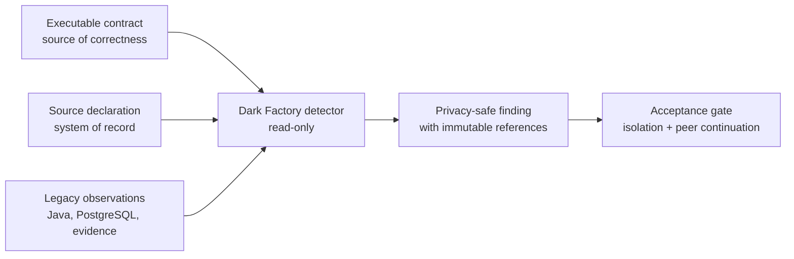

# NorthWind Pay EDP — Dark Factory starting brief

## Status

Implementation pending. This document is the bounded starting brief for the
next session; it is not evidence that a Dark Factory component exists.

The [legacy baseline](legacy.md) is complete and observable. The
[modern pipeline](modern.md) remains planned and is not a prerequisite for the
first Dark Factory slice. It is, however, part of the complete Dark Factory
goal: a factory is only "100% running" when it autonomously builds the modern
pipeline and closes every golden-match against the legacy oracle.

## Autonomous end-to-end execution mandate — 2026-07-24

This section authorizes a lights-out run. A session explicitly invoked to
"execute the autonomous mandate" of this plan proceeds end-to-end without
waiting for human approval, under the rules below. For that run only, this
section supersedes the "stop for review" checkpoints later in this document
and the "pending design decisions belong to a future design turn" deferral in
`plans/modern.md`. Interactive sessions that were not invoked with the
mandate keep the original stop-for-review behavior.

### Standing authorization

- The executing agent decides every open design question itself: the finding
  schema, directory ownership, Python packaging, Parquet canonicalization,
  the dlt role, dbt grains and keys, golden-match keys, the Dagster model,
  and anything comparable.
- Every such decision is recorded as a numbered decision record in
  `docs/decisions/NNN-short-title.md` (context, decision, alternatives
  considered, consequences) in the same commit that first implements it.
- Human review happens after the run — from decision records, commits, the
  run journal, and evidence — not during it.

### Phase 0 — re-prove the committed baseline (mandatory first act)

The 2026-07-24 proof ledger identifies implementation manifest
`d3e6e95a…` (260 files). The committed tree differs (268 files) because the
Type `01` parity refactor landed after the authoritative five-type proof;
only the Type `01` vertical was re-proven live on the final bytes. Therefore,
before any Dark Factory code:

1. `make init && make deploy && make status`.
2. `make check`.
3. `make test` — the full 25-case automatic-worker portfolio — on that fresh
   runtime.
4. `make clean CONFIRM=clean-runtime`, redeploy, then `make test-e2e TYPE=all`
   (the two portfolios reuse canonical batch IDs and must not share one
   runtime).
5. Append a dated ledger entry to `plans/legacy.md` with the results and a
   freshly computed manifest hash of the committed tree.

Nothing in `legacy/`, `contracts/`, `gen/`, `infra/`, or applied migrations
may change to make Phase 0 pass. A red gate here is a blocker report, not a
license to fix legacy.

### Phase 1 — Type 01 detector slice

Execute Steps 1–6 of the build sequence below, in order, honoring every gate.
"Stop for review" becomes a decision record plus self-review; the
deterministic gates themselves are unchanged and mandatory.

### Phase 2 — detector expansion

`DF-SOURCE-002` through `DF-SOURCE-005`, one completed type at a time. Each
type passes all six step gates and its acceptance target before the next
type begins.

### Phase 3 — the modern pipeline, built as the factory's product

Execute `plans/modern.md` milestones M0–M6 under all of that plan's
boundaries: Type `01` first through the closed golden-match (M0–M3), then
Dagster and evidence (M4), then Types `02`–`05` one vertical slice at a time
(M5), then serve and harden (M6). The detector may consume modern
observations only as an additional read-only channel; it never computes
modern business results.

### Phase 4 — definition of "Dark Factory 100% running"

The run is complete only when, each on a fresh isolated runtime:

- Phase 0 baseline gates are green on the committed tree;
- detector findings for all five `DF-SOURCE-*` scenarios are byte-stable,
  privacy-clean, and acceptance-verified with isolation and peer
  continuation proven;
- modern Types `01`–`05` reach Gold with zero unexplained golden-match
  differences, every difference classified per `plans/modern.md`;
- complete privacy-safe evidence packets exist for legacy, detector, and
  modern runs;
- one documented top-level command per system reproduces each proof.

### Rules of engagement

- Work only in the dedicated worktree and its branch. Commit in small,
  gate-passing increments. Never push, open PRs, send notifications, or make
  any external write unless separately instructed.
- The non-negotiable boundaries below apply to every phase of the run.
- Never weaken, edit, or "fix" an expected value, contract fixture, or
  oracle to turn a red gate green. Green must come from the referee.
- Fresh isolated runtime for every authoritative acceptance; never clean
  state implicitly.
- Maintain `plans/df-run-journal.md`: one dated entry per phase and gate
  with status, evidence paths, decision-record references, and blockers.
- Hard-stop conditions — halt and report instead of continuing: any
  restricted value outside the privacy allowlist in a produced artifact; any
  mutation of frozen legacy inputs; a gate that cannot pass without changing
  frozen truth; Docker or the local runtime unavailable.

### Prerequisites

Docker with Compose running, GNU Make, Python 3.12+, and free local ports
for the SFTP/PostgreSQL stack.

## First objective

Build one read-only Type `01` vertical slice that detects and attributes the
canonical source-system control mismatch from existing immutable observations,
emits a privacy-safe finding, proves the affected batch remains isolated, and
proves unrelated batches continue.



## Non-negotiable boundaries

- Do not modify source declarations, raw SFTP bytes, legacy Java results,
  PostgreSQL observations, canonical fixtures, or expected outcomes.
- Keep system of record, source of observation, source of correctness, and
  executable Git contract separate in code and evidence.
- Treat model output as a proposal, never as correctness evidence.
- Bind a finding to exact batch, type, raw hash, manifest hash, contract
  identity, observation references, and detector version.
- Emit no PAN, CPF, CNPJ, account, name, prohibited description, raw row, or
  unrestricted exception text.
- Quarantine remains a legacy runtime action. The first Dark Factory slice
  observes and verifies that result; it does not move files or repair data.
- No remediation, contract change, external message, or deployment occurs
  without a separately designed approval gate.
- Every authoritative live run uses a fresh isolated runtime.

## First acceptance target

| Field | Expected value |
|---|---|
| Type | `01` |
| Scenario | `DF-SOURCE-001` |
| Batch | `B202607230000004` |
| Source-owned net declaration | `173.44` |
| Independently computed net | `173.45` |
| Detail count | Declared `2`, computed `2` |
| Legacy terminal status | `quarantined` |
| Legacy terminal code | `SOURCE_CONTROL_TOTAL_MISMATCH` |
| Attribution | Source system of record |
| Sanitized CSV | Absent |
| PostgreSQL business mutation | Zero |
| Finding scope | Affected batch only |
| Required peer continuation | `B202402290000001` and `B202607230000002` succeed |

The contract oracle for this target is
`contracts/types/01-card-settlement/main/expected-df-source-001-finding.yaml`.
The legacy proof route is `make test-type01`.

## Proposed first implementation surfaces

Names are provisional until the first task specification is approved:

```text
dark-factory/
├── contracts/
│   └── finding.schema.json
├── src/
│   ├── observations/          read-only legacy evidence adapters
│   ├── detection/             deterministic control comparison
│   ├── attribution/           evidence-based source/component ownership
│   ├── findings/              privacy-safe canonical finding writer
│   └── cli.py                 one bounded local entrypoint
└── tests/
    ├── contract/
    ├── unit/
    ├── security/
    └── end-to-end/
```

Do not scaffold these directories until their ownership and contracts are
approved. The first implementation should be deterministic code; an agent may
coordinate or explain the result later, but it must not replace the detector.

## Finding contract — first design task

The first turn of implementation should approve a closed finding schema with
at least:

- finding and schema version;
- stable finding code;
- batch and exact type identity;
- source-system/component attribution;
- declared and computed privacy-safe controls;
- terminal status and quarantine code;
- mutation and peer-continuation observations;
- raw, manifest, contract, observation, and detector hashes or references;
- detector method and confidence semantics;
- creation time supplied by the runtime, not used in deterministic identity;
- approval/remediation state explicitly set to `not_requested`.

The schema must reject unknown fields and must have a restricted-value scan.

## Build sequence

### Step 1 — freeze the finding contract

- Define the closed JSON schema and one exact Type `01` expected finding.
- Define canonical JSON and finding identity.
- Define the privacy allowlist and stable error codes.

**Gate:** independent contract tests reject drift, extra fields, and restricted
values.

### Step 2 — read immutable observations

- Read the source manifest and relevant legacy evidence without mutation.
- Validate exact batch/type/hash lineage.
- Refuse missing, cross-batch, ambiguous, or contradictory observation sets.

**Gate:** no adapter has a write path to SFTP, PostgreSQL, legacy evidence, or
contracts.

### Step 3 — detect the Type 01 control mismatch

- Compare declared net and detail count with independently computed controls.
- Produce no finding for matched controls.
- Produce exactly one stable finding for the one-cent mismatch.

**Gate:** deterministic input produces byte-identical canonical finding data.

### Step 4 — attribute with evidence

- Attribute the discrepancy to the source system of record because the raw
  declaration is wrong while independent observations agree.
- Keep detection, attribution, and explanation as separate fields.
- Fail closed when observations do not support one attribution.

**Gate:** removing any required independent observation prevents a conclusive
attribution.

### Step 5 — prove isolation and continuation

- Verify the source-defect batch has no sanitized CSV or business rows.
- Verify its exact quarantine status and code.
- Verify the two approved peer batches still succeed and reconcile.

**Gate:** the finding is incomplete unless both isolation and continuation are
observed.

### Step 6 — emit the evidence packet

- Write the canonical finding atomically under a separate Dark Factory
  evidence root.
- Include hashes/references, not copied raw values.
- Add contract, unit, security, and end-to-end tests plus a Make facade.

**Gate:** a fresh local run recreates the expected finding with no privacy
leak or legacy mutation.

## Expansion seeds after Type 01

| Type | Scenario | Batch | Stable legacy code | Deliberate source defect |
|---|---|---|---|---|
| `01` | `DF-SOURCE-001` | `B202607230000004` | `SOURCE_CONTROL_TOTAL_MISMATCH` | Net `173.44` vs `173.45` |
| `02` | `DF-SOURCE-002` | `B202607230000105` | `SOURCE_CONTROL_NET_MISMATCH` | Net `173.44` vs `173.45` |
| `03` | `DF-SOURCE-003` | `B202607230000205` | `SOURCE_CONTROL_NET_MISMATCH` | Net `198.49` vs `198.50` |
| `04` | `DF-SOURCE-004` | `B202607230000305` | `SOURCE_CONTROL_NET_MISMATCH` | Net `999.99` vs `1000.00` |
| `05` | `DF-SOURCE-005` | `B202607230000405` | `SOURCE_CONTROL_ASSESSED_FEE_MISMATCH` | Assessed fee `0.99` vs `1.00` |

Each existing seed expects Java-stage detection, batch quarantine, no
sanitized output, no PostgreSQL business mutation, and peer continuation.
Expansion happens one completed type at a time.

## Explicitly out of scope for the first slice

- Autonomous remediation or source-data correction.
- Changing legacy or modern business logic.
- Building the modern pipeline.
- Multi-agent scheduling, model routing, or self-modifying prompts.
- Natural-language SQL.
- Notifications, tickets, pull requests, or external writes.
- Production deployment.
- Types `02`–`05` implementation before Type `01` acceptance passes.

## Next-session starting point

A session invoked to execute the autonomous mandate begins with Phase 0 and
runs end-to-end under the mandate's rules; the out-of-scope list above yields
to the mandate's phased scope (modern implementation enters in Phase 3, still
under `plans/modern.md` boundaries; external writes and production deployment
remain excluded).

Any other session begins with Step 1 only: inspect the Type `01` source-defect
oracle and existing evidence shape, propose the closed finding contract and
directory ownership, and stop for review before implementation. Preserve the
evidence boundary: legacy is implemented, Dark Factory is pending, and modern
is planned.
