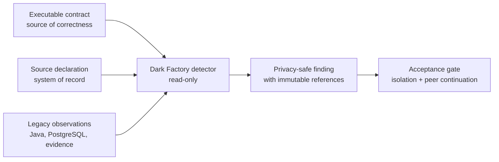

# NorthWind Pay EDP — Dark Factory starting brief

## Status

Implementation pending. This document is the bounded starting brief for the
next session; it is not evidence that a Dark Factory component exists.

The [legacy baseline](legacy.md) is complete and observable. The
[modern pipeline](modern.md) remains planned and is not a prerequisite for the
first Dark Factory slice.

## First objective

Build one read-only Type `01` vertical slice that detects and attributes the
canonical source-system control mismatch from existing immutable observations,
emits a privacy-safe finding, proves the affected batch remains isolated, and
proves unrelated batches continue.



## Non-negotiable boundaries

- Do not modify source declarations, raw SFTP bytes, legacy Java results,
  PostgreSQL observations, canonical fixtures, or expected outcomes.
- Keep system of record, source of observation, source of correctness, and
  executable Git contract separate in code and evidence.
- Treat model output as a proposal, never as correctness evidence.
- Bind a finding to exact batch, type, raw hash, manifest hash, contract
  identity, observation references, and detector version.
- Emit no PAN, CPF, CNPJ, account, name, prohibited description, raw row, or
  unrestricted exception text.
- Quarantine remains a legacy runtime action. The first Dark Factory slice
  observes and verifies that result; it does not move files or repair data.
- No remediation, contract change, external message, or deployment occurs
  without a separately designed approval gate.
- Every authoritative live run uses a fresh isolated runtime.

## First acceptance target

| Field | Expected value |
|---|---|
| Type | `01` |
| Scenario | `DF-SOURCE-001` |
| Batch | `B202607230000004` |
| Source-owned net declaration | `173.44` |
| Independently computed net | `173.45` |
| Detail count | Declared `2`, computed `2` |
| Legacy terminal status | `quarantined` |
| Legacy terminal code | `SOURCE_CONTROL_TOTAL_MISMATCH` |
| Attribution | Source system of record |
| Sanitized CSV | Absent |
| PostgreSQL business mutation | Zero |
| Finding scope | Affected batch only |
| Required peer continuation | `B202402290000001` and `B202607230000002` succeed |

The contract oracle for this target is
`contracts/types/01-card-settlement/main/expected-df-source-001-finding.yaml`.
The legacy proof route is `make test-type01`.

## Proposed first implementation surfaces

Names are provisional until the first task specification is approved:

```text
dark-factory/
├── contracts/
│   └── finding.schema.json
├── src/
│   ├── observations/          read-only legacy evidence adapters
│   ├── detection/             deterministic control comparison
│   ├── attribution/           evidence-based source/component ownership
│   ├── findings/              privacy-safe canonical finding writer
│   └── cli.py                 one bounded local entrypoint
└── tests/
    ├── contract/
    ├── unit/
    ├── security/
    └── end-to-end/
```

Do not scaffold these directories until their ownership and contracts are
approved. The first implementation should be deterministic code; an agent may
coordinate or explain the result later, but it must not replace the detector.

## Finding contract — first design task

The first turn of implementation should approve a closed finding schema with
at least:

- finding and schema version;
- stable finding code;
- batch and exact type identity;
- source-system/component attribution;
- declared and computed privacy-safe controls;
- terminal status and quarantine code;
- mutation and peer-continuation observations;
- raw, manifest, contract, observation, and detector hashes or references;
- detector method and confidence semantics;
- creation time supplied by the runtime, not used in deterministic identity;
- approval/remediation state explicitly set to `not_requested`.

The schema must reject unknown fields and must have a restricted-value scan.

## Build sequence

### Step 1 — freeze the finding contract

- Define the closed JSON schema and one exact Type `01` expected finding.
- Define canonical JSON and finding identity.
- Define the privacy allowlist and stable error codes.

**Gate:** independent contract tests reject drift, extra fields, and restricted
values.

### Step 2 — read immutable observations

- Read the source manifest and relevant legacy evidence without mutation.
- Validate exact batch/type/hash lineage.
- Refuse missing, cross-batch, ambiguous, or contradictory observation sets.

**Gate:** no adapter has a write path to SFTP, PostgreSQL, legacy evidence, or
contracts.

### Step 3 — detect the Type 01 control mismatch

- Compare declared net and detail count with independently computed controls.
- Produce no finding for matched controls.
- Produce exactly one stable finding for the one-cent mismatch.

**Gate:** deterministic input produces byte-identical canonical finding data.

### Step 4 — attribute with evidence

- Attribute the discrepancy to the source system of record because the raw
  declaration is wrong while independent observations agree.
- Keep detection, attribution, and explanation as separate fields.
- Fail closed when observations do not support one attribution.

**Gate:** removing any required independent observation prevents a conclusive
attribution.

### Step 5 — prove isolation and continuation

- Verify the source-defect batch has no sanitized CSV or business rows.
- Verify its exact quarantine status and code.
- Verify the two approved peer batches still succeed and reconcile.

**Gate:** the finding is incomplete unless both isolation and continuation are
observed.

### Step 6 — emit the evidence packet

- Write the canonical finding atomically under a separate Dark Factory
  evidence root.
- Include hashes/references, not copied raw values.
- Add contract, unit, security, and end-to-end tests plus a Make facade.

**Gate:** a fresh local run recreates the expected finding with no privacy
leak or legacy mutation.

## Expansion seeds after Type 01

| Type | Scenario | Batch | Stable legacy code | Deliberate source defect |
|---|---|---|---|---|
| `01` | `DF-SOURCE-001` | `B202607230000004` | `SOURCE_CONTROL_TOTAL_MISMATCH` | Net `173.44` vs `173.45` |
| `02` | `DF-SOURCE-002` | `B202607230000105` | `SOURCE_CONTROL_NET_MISMATCH` | Net `173.44` vs `173.45` |
| `03` | `DF-SOURCE-003` | `B202607230000205` | `SOURCE_CONTROL_NET_MISMATCH` | Net `198.49` vs `198.50` |
| `04` | `DF-SOURCE-004` | `B202607230000305` | `SOURCE_CONTROL_NET_MISMATCH` | Net `999.99` vs `1000.00` |
| `05` | `DF-SOURCE-005` | `B202607230000405` | `SOURCE_CONTROL_ASSESSED_FEE_MISMATCH` | Assessed fee `0.99` vs `1.00` |

Each existing seed expects Java-stage detection, batch quarantine, no
sanitized output, no PostgreSQL business mutation, and peer continuation.
Expansion happens one completed type at a time.

## Explicitly out of scope for the first slice

- Autonomous remediation or source-data correction.
- Changing legacy or modern business logic.
- Building the modern pipeline.
- Multi-agent scheduling, model routing, or self-modifying prompts.
- Natural-language SQL.
- Notifications, tickets, pull requests, or external writes.
- Production deployment.
- Types `02`–`05` implementation before Type `01` acceptance passes.

## Next-session starting point

Begin with Step 1 only: inspect the Type `01` source-defect oracle and existing
evidence shape, propose the closed finding contract and directory ownership,
and stop for review before implementation. Preserve the evidence boundary:
legacy is implemented, Dark Factory is pending, and modern is planned.
