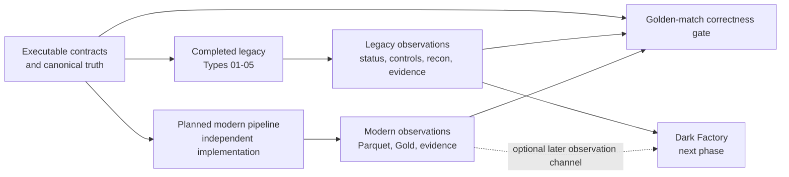
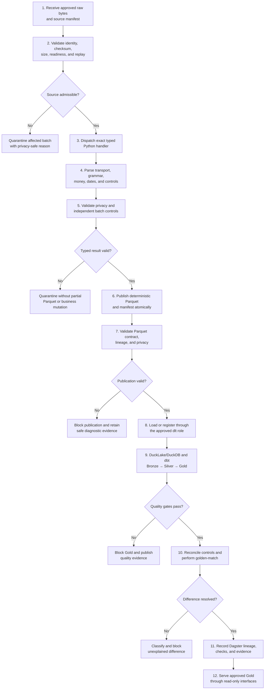

# NorthWind Pay EDP — modern target plan

## Status and evidence boundary

The modern pipeline is a target architecture, not a current implementation.
The completed [legacy baseline](legacy.md) is the observable reference for the
next phases.

| Area | Live repository state |
|---|---|
| Legacy Types `01`–`05` | Implemented and live verified through contracts, DataGen, SFTP, Java, PostgreSQL, reconciliation, oracle, and evidence |
| Type `01` parity | Explicitly standardized and independently reverified |
| Dark Factory | Next implementation phase; starting brief exists, but no runtime or agent loop exists |
| Modern pipeline | Planned only; no `modern/` source tree, Parquet, lakehouse, dbt, Dagster, API, or MCP implementation exists |
| Release boundary | The implementation is local working-tree content; no committed-release or clean-checkout CI claim exists |

The earlier version of this plan described a planning-only repository and ten
existing legacy types. That is no longer accurate. The proven shared baseline
is five types. Types `06`–`10` require new contracts and observations before
they can enter either legacy parity or modern implementation scope.

## Relationship among legacy, Dark Factory, and modern

These are separate systems with separate evidence:



- Legacy is complete and can be observed now.
- Dark Factory may begin against the legacy observation surfaces without
  waiting for modern.
- Modern is a future independent implementation, not part of Dark Factory.
- Golden-match compares observations; it is not the Dark Factory.
- Neither modern nor Dark Factory may rewrite legacy observations or contract
  expectations to manufacture agreement.

## Goal

Build an independent modern replacement for the same five approved raw file
types and produce deterministic, privacy-safe analytical results locally:

```text
same approved raw bytes and source manifest
  → event-driven Python ingestion
  → deterministic sanitized Parquet
  → approved dlt loading or registration role
  → DuckLake and DuckDB
  → dbt Bronze, Silver, and Gold
  → golden-match and terminal-outcome parity
  → Dagster lineage and evidence
  → read-only FastAPI and narrow MCP tools
```

The modern system must not call the legacy Java processor, import its parsing
logic, or reuse legacy stored procedures to calculate a result. Legacy CSV,
PostgreSQL state, and evidence are comparison observations only. The executable
contracts and independently approved truth sets remain the source of
correctness.

## Shared boundaries with legacy

| Shared boundary | Rule |
|---|---|
| Contract identity | Use the exact number, code, contract version, and layout version under `contracts/types/` |
| Raw input | Process the exact same bytes and source manifest used by legacy |
| Supported formats | Respect the type-specific `.dat`, `.txt`, `.rem`, and `.csv` transport contracts |
| Implementations | Java/PostgreSQL and Python/lakehouse remain independent |
| Legacy CSV | Comparison evidence only; never a modern input |
| Legacy PostgreSQL | Observation environment only; never a modern source database |
| Correctness | Compare both systems with independent expected outcomes |
| Source defects | Preserve the wrong source-owned declaration and compare it with independent calculations |
| Privacy | Modern output may contain only contract-approved transformations |
| Terminal behavior | Compare success, rejection code, isolation, mutation, and peer continuation—not only successful rows |

Type `01` Card Settlement Detail is the approved first shared slice. Its raw
fixtures, sanitized expectations, reconciliation, source-defect outcome, and
legacy evidence path are complete and live verified.

## First modern tranche

### Included

- Types `01`–`05`, one vertical slice at a time.
- Python packages organized as `model → parser → schema → writer → handler`.
- Type-specific parsing:
  - Type `01`: ISO-8859-1 fixed width and COBOL overpunch;
  - Type `02`: UTF-8 escaped pipe grammar;
  - Type `03`: exact 240-byte CRLF remittance records;
  - Type `04`: heterogeneous fixed widths and inherited return context;
  - Type `05`: quote-aware semicolon CSV, NFC, decimal comma, and `HALF_UP`.
- Exact `Decimal` financial arithmetic.
- Contract-approved masking, tokenization, and safe passthrough rules.
- Deterministic sanitized Parquet with immutable provenance.
- An explicitly approved dlt, DuckLake, and DuckDB handoff.
- dbt Bronze, Silver, and Gold models with exact grains and controls.
- Golden-match against contract truth and legacy observation.
- Dagster orchestration, lineage, retries, and evidence.
- One read-only FastAPI surface and narrow MCP tools over approved Gold.
- Local execution, privacy gates, and reproducible tests.

### Excluded

- Modifying completed legacy behavior to simplify modern implementation.
- Types `06`–`10` before their contracts and reference observations exist.
- The complete 30-plus file-type estate.
- Unrestricted natural-language SQL.
- Cloud deployment before a target is selected.
- Treating Dark Factory, golden-match, or modern orchestration as the same
  subsystem.
- Claiming production or CI readiness from local proof alone.

## Modern runtime flow



For canonical rejected batches, the flow ends before Parquet and Gold. That is
an expected terminal result, not missing data.

## Target repository additions

Current legacy paths remain in place. Modern work should add, not rename, the
following boundaries:

```text
uc-northwind-pay-edp/
├── contracts/
│   └── types/                         approved Types 01-05
├── plans/
│   ├── legacy.md                      completed oracle baseline
│   ├── modern.md                      this target plan
│   └── dark-factory.md                next-phase starting brief
├── modern/                            not implemented
│   ├── ingestion/
│   │   └── src/northwind_pay/
│   │       ├── common/
│   │       ├── intake/
│   │       └── types/
│   │           └── <number-name>/
│   │               ├── model.py
│   │               ├── parser.py
│   │               ├── schema.py
│   │               ├── writer.py
│   │               └── handler.py
│   ├── landing/
│   ├── lakehouse/
│   │   ├── dlt/
│   │   ├── ducklake/
│   │   └── duckdb/
│   ├── dbt/
│   │   ├── models/bronze/
│   │   ├── models/silver/
│   │   ├── models/gold/
│   │   └── tests/
│   ├── dagster/
│   ├── serving/
│   │   ├── api/
│   │   └── mcp/
│   └── observability/
├── validation/
│   ├── oracle/                        completed legacy oracle
│   └── golden-match/                  planned comparison boundary
├── tests/
│   └── modern/                        planned layered modern tests
└── evidence/
    └── modern/                         generated and normally ignored
```

The exact package and tooling choices remain design decisions. This tree names
trust boundaries; it does not authorize empty scaffolding or imply that the
components exist.

## Implementation package for one type

```text
modern/ingestion/src/northwind_pay/types/<number-name>/
├── model.py        typed domain records and exact Decimal values
├── parser.py       transport, positions, grammar, encoding, dates, and signs
├── schema.py       validation, privacy-safe fields, and controls
├── writer.py       deterministic atomic Parquet plus metadata
└── handler.py      composes the four boundaries for one batch
```

Shared libraries may own genuinely universal mechanics such as exact money,
checksums, idempotency, quarantine, and provenance. Type-specific grammar,
privacy, rounding, precedence, and reconciliation remain inside the numbered
package.

## Modern data zones

| Zone | Meaning |
|---|---|
| Restricted raw | Original file and manifest; ingestion-only access |
| Landing | Immutable sanitized Parquet plus lineage metadata |
| Bronze | Typed, source-aligned records with minimal reinterpretation |
| Silver | Conformed entities, signs, dates, and business grain |
| Gold | Governed reports, controls, and reconciliations |

FastAPI and MCP use approved Gold by default. They must not expose restricted
raw values, clear-text PII, incomplete batches, or unresolved reconciliations.

## Implementation rules

### Python and Parquet

- Use `Decimal`, never binary floating point, for money.
- Parse bytes according to the exact numbered contract.
- Keep detection and record-validation precedence deterministic.
- Transform prohibited values before any Parquet publication.
- Pin schema, compression, ordering, metadata, and canonical hashing.
- Publish Parquet and its readiness manifest atomically.
- Make replay identity-bound, deterministic, and idempotent.

### Lakehouse and dbt

- Give dlt one explicit role; do not duplicate ownership with the writer.
- Keep landing immutable.
- Give Bronze, Silver, and Gold one documented grain and owner each.
- Add structural, privacy, lineage, and financial business-rule tests.
- Block Gold when upstream identity, schema, or quality checks fail.

### Dagster and serving

- Keep parsing and business logic outside orchestration code.
- Use Dagster for sensing, dependencies, retries, partitions, backfills,
  checks, and lineage.
- Serve only an approved immutable Gold snapshot.
- Start with explicit read-only API endpoints and narrow MCP tools.
- Never expose arbitrary SQL over restricted or unapproved zones.

## Golden-match and terminal parity

Every comparison asks two separate questions:

1. **Legacy parity:** did modern reach the same observable outcome as legacy?
2. **Business correctness:** did modern satisfy the approved contract and
   independently reviewed expectation?

A source defect or legacy defect can make those answers differ. Classify every
difference as exactly one of:

- `CONFIRMED_SOURCE_DEFECT`
- `CONFIRMED_LEGACY_DEFECT`
- `MODERN_DEFECT`
- `APPROVED_BEHAVIOR_CHANGE`
- `CONTRACT_AMBIGUITY`
- `UNRESOLVED`

The release gate permits no unexplained financial difference. No silent
tolerance is allowed unless the contract explicitly defines one.

Successful comparisons cover records, controls, reconciliation, and Gold.
Rejected comparisons cover:

- terminal status and stable rejection code;
- declared versus independently computed controls;
- batch-scoped quarantine;
- zero Parquet, Gold, and business mutation;
- no partial publication;
- unaffected peer continuation.

The five existing `DF-SOURCE-*` fixtures are confirmed source-system seeds,
not confirmed legacy defects and not proof of a Dark Factory.

## Relationship to Dark Factory

Dark Factory is the next repository phase, but it remains implementation
pending. Its first slice may consume the completed legacy observation surfaces
read-only. Modern can later become another independent observation channel.

Dark Factory must not:

- calculate modern business results;
- replace golden-match;
- rewrite source declarations, legacy output, or modern output;
- treat a model judgment as correctness evidence;
- make an external change without its own contract and approval gate.

The next session should begin from
[`plans/dark-factory.md`](dark-factory.md), not by creating `modern/`.

## Build order

### Milestone 0 — approve the modern task specification

- Use Type `01` as the first slice.
- Freeze the raw, Parquet, Bronze, Silver, Gold, and comparison grains.
- Decide Python packaging, schema tooling, Parquet canonicalization, and dlt's
  exact role.
- Define privacy and evidence gates before production code.

**Gate:** every handoff has one owner, one input contract, and one accepted
output.

### Milestone 1 — Type 01 Python-to-Parquet

- Implement Type `01` model, parser, schema, writer, and handler.
- Cover all five canonical outcomes plus replay and immutable conflict.
- Produce no Parquet for rejected source or malformed batches.

**Gate:** identical approved inputs and versions produce identical canonical
Parquet and terminal evidence.

### Milestone 2 — Type 01 lakehouse and dbt path

- Load or register Parquet through the approved dlt boundary.
- Configure DuckLake and DuckDB locally.
- Build and test Bronze → Silver → Gold.
- Produce a modern reconciliation.

**Gate:** a clean local environment can rebuild the approved Gold result.

### Milestone 3 — close Type 01 golden-match

- Compare modern output with legacy observations.
- Compare both with contract truth.
- Compare canonical rejection and source-defect terminal outcomes.
- Produce a structured difference report.

**Gate:** Type `01` has zero unexplained differences.

### Milestone 4 — add Dagster and modern evidence

- Model deterministic components as assets.
- Add sensing, retries, partitions, backfills, checks, and lineage.
- Prove direct and orchestrated execution produce the same result.

**Gate:** replay is safe and the evidence packet is complete and privacy-safe.

### Milestone 5 — expand through Types 02–05

Add one complete vertical slice at a time. Do not create empty type packages
in advance.

**Gate:** all five types run independently and as mixed batches with zero
unexplained differences.

### Milestone 6 — serve and harden

- Add one read-only reconciliation API.
- Add narrow MCP tools for batch status, reconciliation, and difference
  explanation.
- Add authorization, audit, observability, PII scans, and clean-environment
  CI.
- Add Terraform or Terragrunt only after selecting a deployment target.

**Gate:** no unapproved or incomplete result can be served or released.

Types `06`–`10` become a later milestone only after their contracts, legacy
observations, and explicit scope approval exist.

## Completion checklist for each type

- [ ] Approved numbered raw contract and five canonical outcomes.
- [ ] Model, parser, schema, writer, and handler implemented.
- [ ] Deterministic transport, replay, conflict, and privacy tests passing.
- [ ] Canonical Parquet contract approved.
- [ ] Bronze, Silver, and Gold grains and tests approved.
- [ ] Modern reconciliation approved.
- [ ] Success and rejection terminal parity verified.
- [ ] Golden-match has zero unexplained differences.
- [ ] Dagster direct/orchestrated equivalence and replay passing.
- [ ] Complete immutable privacy-safe evidence generated.
- [ ] Clean-environment end-to-end test passing.

## Modern batch evidence

An accepted batch should produce:

```text
evidence/modern/<batch-id>/
├── source-manifest.json
├── raw-file.sha256
├── parser-run.json
├── privacy-scan.json
├── parquet-file.sha256
├── parquet-contract-result.json
├── dlt-load.json
├── ducklake-snapshot.json
├── dbt-results.json
├── dagster-run.json
├── golden-match.json
├── difference-adjudication.json
└── final-status.json
```

A rejected batch must have a smaller explicit schema and must not invent
Parquet, lakehouse, dbt, or Gold artifacts that were never created.

## Resolved and pending design decisions

### Resolved

- First shared slice: Type `01` Card Settlement Detail.
- Shared truth root: `contracts/types/01-card-settlement/main/`.
- Legacy fixtures, terminal expectations, reconciliation, and live evidence
  route are approved.
- Source-defect attribution compares source-owned declarations with
  independent Java, PostgreSQL, and oracle observations.
- Modern must be independent from Java and PL/pgSQL calculations.

### Pending before modern coding

1. Python version, packaging tool, and validation libraries.
2. Canonical Parquet schema, compression, ordering, partitioning, and metadata.
3. Exact dlt loading or registration role.
4. DuckLake storage and catalog placement.
5. Bronze, Silver, and Gold grains and keys.
6. Rule allocation between ingestion and dbt.
7. Record and aggregate keys for golden-match.
8. Dagster asset, partition, retry, and backfill model.
9. First read-only FastAPI endpoint and MCP tools.
10. CI and deployment boundary.

These decisions belong to a future modern design turn. They are not blockers
for beginning the read-only Dark Factory slice.

## Modern definition of done

The first modern foundation is complete only when Types `01`–`05` independently
process the same approved raw inputs through Python, deterministic Parquet,
DuckLake/DuckDB, and Bronze/Silver/Gold; accepted and rejected outcomes have
zero unexplained differences; Dagster can process and replay safely; only
approved Gold is served; prohibited values do not leak; and clean-environment
gates block financial, schema, privacy, lineage, and evidence regressions.
